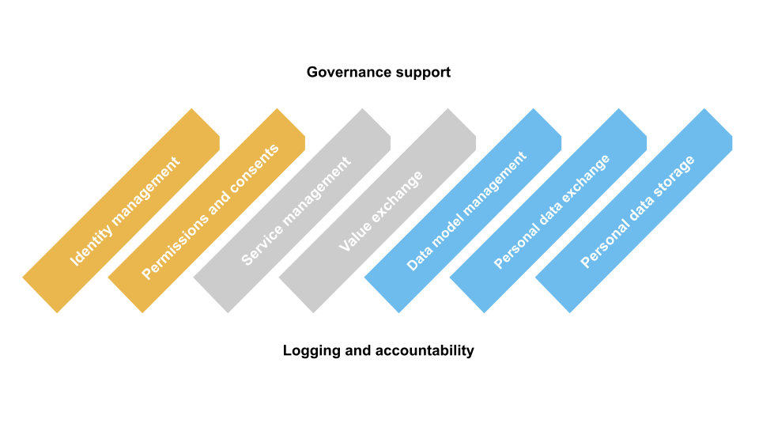

The MyData operator reference model describes nine core functional elements of operators as illustrated in the figure below. These elements either indepdently or collectively make it possible to utilise personal data in a transparent and human-centric manner and supports interoperability between data operators via open and standardised interfaces.

:::note

These functional elements are selected elements for inclusion in the reference model based on the criteria that they are relevant in the context of MyDataand are directly valuable to individuals. Not all operators will have all functional elements - it is not intended as template for a single, complete implementation.

:::

## Identity management

Individuals can have different identities, or profiles, with different Data Sources and Data Using Services. For example, they can have public as well as private identities, or self-sovereign identities (SSI). Identity management handles authentication and authorisation of individuals and organisations (further split to owners, admins, developers and DPO roles) to iGrant.io.  

The key identity management use cases include ability for individuals to authenticate and authorise access to the iGrant.io system. It provides functions to federate different identity solutions compliant with OpenID Connect and OAuth2.0, compliance with Web 2.0 standards. For example, the Data Source and Data Using service could be using different national identity solution. In Sweden, the solution already integrates with BankID and the intention is to integrate with other national ID systems including eIDAS.

The solution also enables self-sovereign identity via the use of decentralised identifiers (DIDs) with a DID Registry and Verified Credentials (VC), all as per the Web 3.0 (W3C specification). 

## Permissions and consents

Permission management enables humancentric control of personal data, such as the user interfaces and underlying data data structures for individuals to view, understand, grant, revoke, and modify different kinds of permissions related to data flows. It enables individuals to manage and have an overview of data transactions and connections and to execute their legal rights (e.g. as per GDPR). 

One of the key strengths of iGrant.io is that it enables consented data exchange which makes permission management a vital component. Using iGrant.io services, organisations can manage consents from individuals throughout the lifecycle of the consent agreement. Consents may be active, given in real-time; or passive, given at any time. In either case, individuals can use the iGrant.io service to re-evaluate their consents if and whenever the need arises.

The typical end to end use case for enabling permissions and consents in iGrant.io is described below:
> 1. Organisation (admin) registers their data model and configures the data agreement that consists of the purpose for which the data attributes being used, the data attributes used by the purpose, legal basis, etc. In this case, the legal basis for the data agreement is "Consent".
> 
> 2. The org publishes the purpose towards its individual users. 
> 
> 3. The individuals are able view at the lowest granularity levels (aka attribute level e.g. name, phone number). It allows individuals to exercise their rights (their data subject rights as per GDPR Article 12-23) and they can opt-in and opt-out of any data usage at various granularity levels, where consent is used as a lawful basis. This can be done in real-time.

iGrant.io supports multiple, consent receipt mechanisms including Kantara standards for consent receipts. The approach taken is to register any consent receipt format during provisioning as it was deemed too heavy in a data exchange scenario and Kantara compliant receipts are provided as RESTful APIs for customer cases and interoperability scenarios.

With iGrant.io, an organisation can be transparent about what data is being used and based on what lawful basis the data is processed, e.g. contract, legal obligation, vital interests, public task, legitimate interests and consents as per Article 6 in the GDPR. The individual is then able to transparently view all different usage purposes for which their personal data is used. For data exchange with consents, the individual is able to opt-in/opt-out to any purpose, at the attribute levels. 

## Service management

Data operators live in an ecosystem with Data Sources and Data Using Services. In order to navigate this ecosystem, the various actors are linked through a data operator. Service management onboards the various actors within the ecosystem. The human-centric manifestation of service management is the possibility for individuals to manage the relationships and connections to different data sources and data using services in the ecosystem.

iGrant.io enables a multi-operator environment via a distributed service registry at two levels: one at the individual level, the other at the organisational level. 

In figure above, A, B and C are organisations (**Data Sources** and **Data Using Services**) while the dotted circle represents the ecosystem and the governance framework facilitating consented (by the individual) data exchange. iGrant.io has filed an international patent on facilitating a consented data exchange. 

### Organisation level
For organisations, it involves controller and processor agreement handling as part of a data ecosystem. This includes functions like organisation onboarding/provisioning, managing organisation users, adding end users or consumers to organisation, agreement handling between a organisations and towards individuals for data exchange, data regulation and compliance management etc.

### Individual level 
For individuals, the service management function lies in enabling a decentralised application (dApp). This includes functions like registrations, user profile management, subscription to a specific organisatione etc.

## Value exchange

A sustainable business model is a requisites for any ecosystem. In a MyData Operator ecosystem, this means that all of the actors in the ecosystem need to have more benefits than mere costs. Both benefits and costs can be also non-monetary in nature. 

For individuals, time and effort spent can be a big cost and benefits often come in the form of services that makes their lives easier, for e.g. providing better convenience. As data operators provide technical infrastructure for making multi-party data transactions possible, they are in a natural position to keep track of such transactions for the purposes of payments and billing or creating other forms of rewards, such as loyalty and bonus points. Operators may provide a standard ‘accounting’ mechanism which transparently keeps a log of the data transactions so that the different parties in the ecosystem may use it as the base for payments between the parties. Using data as the means of payment and paying individuals for their data are contentious issues. 

iGrant.io platform keeps track of all data agreement transactions, consents, and data exchange. The platform has a fully auditable transaction model enabling the ecosystem to derive value from a personal data exchange scenario in a lawful manner. This can be accessed via our APIs and our current model is to let organisations decide the value exchange model. 

## Data model management

In a world with different data sources and data using services, differences in data models are inevitable. Data model management, as an operator functionality facilitates translation of one data model to another with the target to enable scalability, interoperability, and re-usability. 

iGrant.io maintains a indexed metadata registry with a publish–subscribe service. It supports all CRUD (create, read, update, and delete) services for managing metadata of the data models for any organisation. These services are used for transparency, compliance, facilitating agreement handling between ecosystem players and exercising personal data rights in a standardised manner.

## Personal data exchange

Personal data exchange, through an operator or facilitated by an operator is key to data portability, access and re-use of personal data. This functionality realises the interfaces to allow data exchange between **Data Sources** and **Data Using Services** in a standardised and secure manner. 

A key aspect of iGrant.io is that it enables a consented data exchange. In this MyData Operator model, personal data flows from a Data Source to a Data Using Service based on the data agreements. The data agreements can be, for e.g., based on consent as legal basis. The other legal basis could be lawful purpose, contract, legal obligation, vital interests, public task and legitimate interests (as per GDPR). If it's without consent, individuals will only have limited or no rights to withdraw the consents, however the individual can still follow what data is processed and why. 

The data exchange follows different models depending on the individual involvement in real-time: 

In an **Active Data Exchange** (also referred to as **data sharing**), the user is actively involved in the exchange of data in real-time. E.g. data exchange using the data wallet functions.

A second form of **Active Data Exchange** is where the individual is notified of a request to use their data by the Data Using Service and the individual agrees for data exchange from a given Data Source. 

In **Passive Data Exchange**, the data is exchanged between the Data Source and Data Using Service based on a data agreement that was signed earlier between the Individial and the organisations involved. Here, iGrant.io facilitates the direct transfer based on a valid permission or consent from the individual.

:::note
With iGrant.io, a data using service can make agreements with various data sources, facilitating the relationship between a data controller or data processor (as defined in the GDPR). iGrant.io takes a data minimisation approach to personal data transfer where only the consent and transaction logs are stored as well as identity data. iGrant.io does not store the actual data that is being exchanged.
:::

## Personal data storage

A Personal Data Store (PDS) helps indiduals to gather, store, manage, use and share information needed to manage ones life better. It provides the individual with tools to control what information you share with which people and organisations, when. These data is originally created at some Data Souces and the data operator helps data to be integrated from multiple sources – harmonising, using and re-sharing it under the individuals control. 

iGrant.io platform client SDKs enable a distributed app (dApp) which acts as a data source for individuals, who can aggregate and hold personal data from multiple data sources (for example in a data wallet) without storing it in the iGrant.io cloud. Using iGrant.io services, individuals can grant permission and transfer that data to any Data Using Service in real-time or otherwise. An individual's personal data can be exchanged between different organisations based on the individual’s preference. 

Although iGrant.io provides any data that can be added to a personal data wallet by the individual, as a platform, iGrant.io has a data minimalistic posture and stores only data relevant to identify a person (e.g., email ID and mobile number) and to federate that identity within an ecosystem. iGrant.io also stores an individual’s consent and various transaction logs which information can also be reused as a data source if the individual so desires.

Using this model, Data Sources and Data Using Services are connected via the indiviual. This configuration reduces  legal liabilities while enbaling greater control to individuals. As the person with the PDS is technically in the center of the data transactions, it can be considered also a highly human-centric approach for data transactions. 

## Governance support 

Human-centric governance helps mediate the relationships between people and organisations. This  functionality in an operator guarantees that MyData
principles are followed and enable compliance with underlying governance frameworks. All data operators, to some degree, need to operate within a framework of governance in order to be transparent about assurances to individuals concerning the quality and trustworthiness of their services. Governance requirements translate into responsibilities for the data operator which can then, in a well governed ecosystem, result in liabilities.

iGrant.io establishes governance support for users, organisations and ecosystem partners. The key governance aspects for individuals are:

> * Agreement handling between individuals and organisations and assertions to ensure this is followed. 
> * Transparency facilitating data subject rights and as per the GDPR 

The key governance aspects of organisations and ecosystem partners are:
> * Agreement handling between Data Sources and Data Using Services to enable data exchange and the set of governance mechanisms around this.
> * All aggreements are easily traces and can be audited by indepdent third party
> * A tamperproof logging of all data agreements and data xchange enable multi-party trust handling via decentralised identifiers  (DID) and verified credentials (VC)

### Webhooks-based event dispatchers

iGrant.io uses event-based dispatchers where organisations can configure their receiving payload URLs. Any user or other events will result in notification towards the organisation that can be integrated as part of the IT workflow. 

### Event notifications

iGrant.io provides organisations to issue notifications for specific events. This could be used, to comply to GDPR during data breaches. These APIs can be integrated to an organisations to enable self governing notifications towards users as part of automating compliance.  

## Accountability and logging

Transparency and accountability are important principles and prerequisites in many legislations. Accountability can enhance assurance and logging can mitigate risks of misuse or unintended use. Logging is not the sole responsibility of the operators and has counterparts in data sources and data using services.
Accountability arrangements may flow from the rules and regulations in the underlying governance framework, but many proto-operators work without an explicit governance framework. Even in those cases, operators have to comply with the relevant legislation that often includes logging and accountability obligations. In general, governance implies some accounting obligations; but if no explicit governance applies, logging and accountability are still needed for auditability and transparency

iGrant.io provides DLT-based immutable logging of all user permissions / consents and data exchanges.  Access logging, security logs and various other types of logs are stored and made available only for organisations. The consent and transaction logs are available for both users and institutions (public and private).
Roadmap items include interoperability towards selected industry verticals. The target is to collaborate with organisations working with standards, such as the Trust Over IP decentralised semantics working group of which iGrant.io is a member. The ambition is also to be an active contributor in the MyData community towards achieving interoperability.
