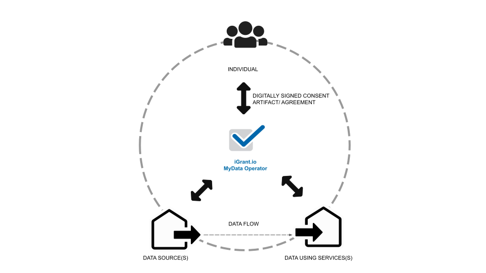
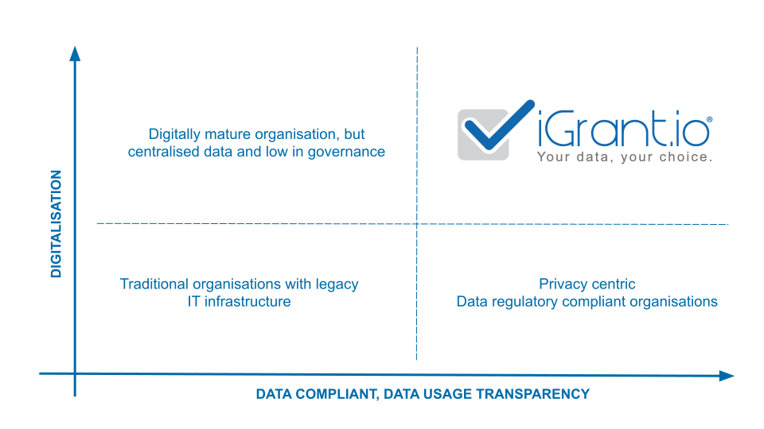
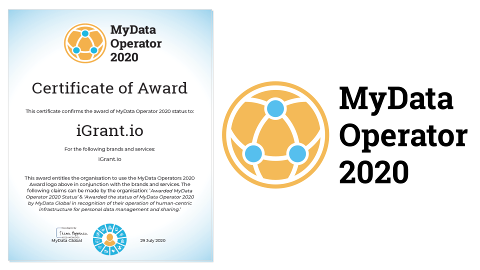

MyData operators, as described in the [MyData Global Operator whitepaper](https://igrant.io/papers/Understanding-Mydata-Operators.pdf), are providers of infrastructure for human-centric personal data management. MyData operators provide interoperability at the technical, informational and governance levels to support the flow of personal data across services. They are examples of a human-centric approach to what the recent EU data strategy calls “novel data intermediaries” and which are set to play a critical role in the provision of the strategy’s vision of data spaces.

## MyData Operator ecosystem

A MyData Operator ecosystem realised by iGrant.io is as illustrated below. 

A typical MyData Operator ecosystem is composed of actors holding one or more of the roles described below:

* **Individual**: This is the role of **data subject** as represented digitally in the ecosystem. In a MyData Operator model, the individual manages the use of personal data about themselves, for their own purposes, and maintain relationships with other persons, services, or organisations.

* **Data Operator**: The role responsible for operating infrastructure and providing tools for the person in a human-centric system of personal data exchange. Operators enable people securely to access, manage, and use personal data about themselves as well as to control the flow of personal data within and between data sources and data using services. 

* **Data Source**: The role responsible for collecting, storing, and controlling personal data which persons, operators, and data using services may wish to access and use. 

* **Data Using Service**: The role responsible for processing personal data from one or more data sources to deliver a service

:::note

iGrant.io does not hold any data from the Data Source but provides the ability to verify the authenticity to any Data Using Service

:::

## Data sharing and data exchange

In iGrant.io MyData Operator, personal data flows from a Data Source to a Data Using Service based on the data agreements. The data agreements can be, for e.g., based on consent. 

In an **Active Data Exchange** (also referred to as **data sharing**), the user is actively involved in the exchange of data in real-time. E.g. data exchange using the data wallet functions. 

In **Passive Data Exchange**, the data is exchanged between the Data Source and Data Using Service based on a data agreement that was signed earlier between the Individial and the organisations involved. 

## Data operator value proposition

Today, a typical organisation is forced to between digitalisation and data compliance. In a MyData Operator model, such as with iGrant.io, an organisation can continue to digitalise while being compliant to data regulations. It creates a WIN-WIN between the individuals and organisations. This is further illustrated below.  

iGrant.io key value propositions as are as summarised below:

### Organisations

It helps organisations, both private and public, **unlock the value of personal data** in a regulatory compliant manner. The key enablers include:

> * Reduces risk of non-compliance to data regulations like for example, Europe’s General Data Protection Regulation (GDPR)
> * Provides API-centric tooling that can easily be integrated to existing IT systems
> * Empowers consumers to exercise their data subject rights thereby establishing and mantaining trust
> * Get access to higher quality personal data and larger data sets
> * Monetise their personal data assets apart from being able to leverage data as part of a personal data ecosystem

### Individuals

For individuals, it enables them to take control over their data via easy to use interfaces to exercise their data rights. Using a data wallet function, individuals are able to carry their data and reuse them where ever needed. E.g. Identity data or health certificates etc.  

## MyData Operator certfication

The MyData Operator 2020 Award recognises operators of human-centric infrastructure for personal data management and sharing. It acknowledges organisations that place the individual at the centre of personal data about them, ensuring that they are the prime beneficiary of the use of this data and providing tools to help them manage personal data.

Organisations applying for MyData Operator 2020 status are required to demonstrate how they create agency for human-centric data control, and how the data and value flows in their ecosystems. To be considered for the award, these organisations must show how their services have the potential to interoperate with data sources, data using services, and each other.

iGrant.io was among the first data operator to be awarded MyData Operator, the first one in Sweden. 
